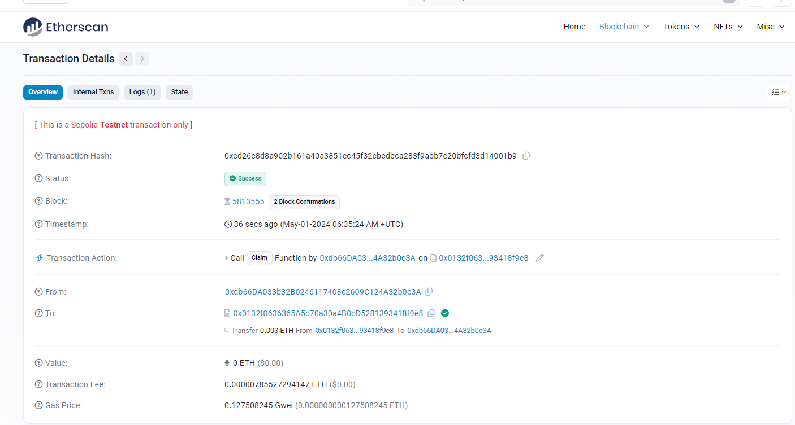
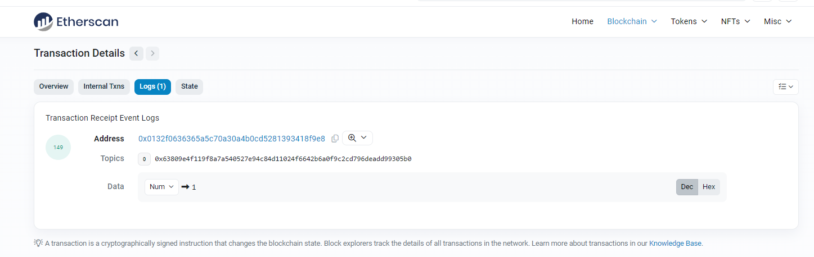
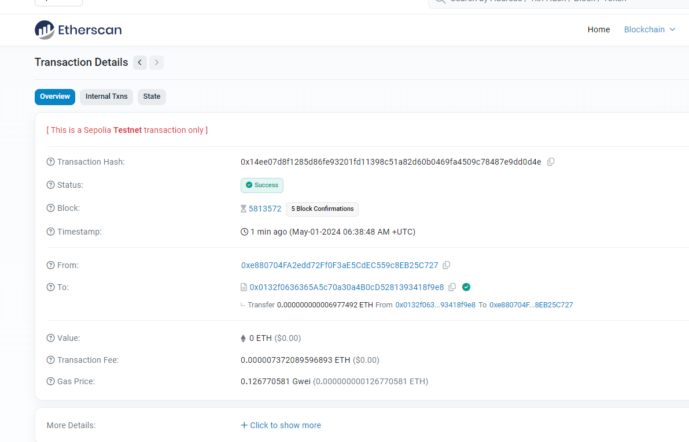

# Life Insurance Smart Contract


## Summary 

This Ethereum smart contract, created by Group 1 of the Encode bootcamp, is designed for a life insurance platform. It leverages the OpenZeppelin library for ERC20 token functionality and integrates with the UsingTellor oracle to fetch external data.

**Key Features:**

- **Token-Based Payments**: The contract uses a custom ERC20 token, `LifeInsuranceToken`, for handling initial seed investment and then commission payments for the investors. Users pay premiums in ETH.
- **Policy Management**: Users can create life insurance policies specifying coverage amount, and personal health data. Premiums are due monthly, with a late fee applied for overdue payments.
- **Commission System**: The contract collects a 1% commission on transactions, which is stored and can be claimed by investors based on their token holdings.
- **Oracle Integration**: Uses the Tellor oracle for external data, primarily to validate claims through external conditions (e.g., BTC spot price as a placeholder for test scenarios). But later will be converted to actual Death info as Oracles from valid government data reporting.
- **Claim Processing**: Policyholders can claim their coverage amount upon meeting certain conditions verified through the oracle. The contract ensures funds are available and adjusts policy status accordingly.
- **Investment Opportunity**: Allows users to invest in the insurance pool by purchasing tokens. It includes functionality to handle investments, token minting, and returns.
- **Testing and Time Management**: Includes mechanisms to manipulate and test time-dependent features such as monthly payments and trigger death info so claims can be paid for testing.

**Security and Usability Features:**

- **Policy Termination**: Policyholders may terminate their policies at any time.
- **Token Purchase and Return**: Participants can buy insurance tokens with ETH and return tokens to reclaim ETH, subject to contract thresholds and conditions.


The contract is robust, with modular features for scalability and updates, aiming to provide a reliable and user-friendly platform for life insurance management on the blockchain.


[LifeInsurance Smart contract code - LifeInsurance.sol](https://github.com/rchak007/LifeInsurance/blob/main/Backend/contracts/LifeInsurance.sol)


# Backend scripts


This Hardhat deployment script utilizes the Viem library to interact with Ethereum networks, specifically targeting the Sepolia testnet. The script configures environmental variables and imports contract ABIs and bytecode for both the `LifeInsurance` and `LifeInsuranceToken` contracts.

* **Environment Setup**: Loads environment variables including private keys and Alchemy API key using the `dotenv` library.

- **Client and Wallet Integration**: Utilizes Viem’s utilities to create public and wallet clients, allowing transactions to be sent from specified accounts.
- **Logging**: Outputs deployed contract addresses to the console, helping users verify the deployment and track deployed contracts.

The script is designed to be robust and adaptable, ensuring that the contracts are deployed seamlessly on the Sepolia testnet, with easy scalability to other networks as needed.


## Deployment Script for Life Insurance Contract

[deployLifeInsurance.ts](https://github.com/rchak007/LifeInsurance/blob/main/Backend/scripts/deployLifeInsurance.ts)

**Key Processes:**

- **Contract Deployment**: Deploys `LifeInsurance` contract with parameters including the token name, symbol, and the predefined token ratio. It also specifies the oracle address for Sepolia.


## Contract State Reading Script for Life Insurance

[LifeInsuranceState.ts](https://github.com/rchak007/LifeInsurance/blob/main/Backend/scripts/LifeInsuranceState.ts)


This Hardhat script is crafted to interact with the Life Insurance smart contract and its associated token contract to fetch and display various states and values. 

**Main Functions of the Script:**

- **State Queries**: Connects to the deployed Life Insurance contract to read various parameters such as the payment token address, insurance thresholds, commission rates, and test values used for simulations.

- **Policy and Token Info Retrieval**: Retrieves detailed information on token holdings for specific accounts and the details of insurance policies held by these accounts, including coverage and holder-specific data.

  


## Token Purchase Script for Life Insurance Investors

[LifeInsurancePurchaseTokens.ts](https://github.com/rchak007/LifeInsurance/blob/main/Backend/scripts/LifeInsurancePurchaseTokens.ts)

This Hardhat script facilitates the process of purchasing tokens from the Life Insurance contract.

**Script Capabilities:**

- **Token Purchase Functionality**: Allows specified accounts to purchase tokens by calling the `purchaseTokens` function of the Life Insurance contract. The script handles transactions and awaits confirmations, ensuring successful execution.
- **Transaction Management**: Outputs transaction hashes and confirmation statuses, providing real-time feedback on the purchase process.

This script is crucial for enabling investors to participate in the Life Insurance platform by acquiring tokens, which are integral to the platform's functionality and the broader investment strategy.


## Policy Creation Script for Life Insurance

[LifeInsurancePolicy.ts](https://github.com/rchak007/LifeInsurance/blob/main/Backend/scripts/LifeInsurancePolicy.ts)

This Hardhat script is designed to facilitate the creation of insurance policies using the Life Insurance smart contract deployed on the Sepolia testnet. Utilizing the Viem library, the script enables direct and efficient interactions with the Ethereum blockchain.

**Functional Overview:**

- **Policy Creation**: Allows specific accounts to create new insurance policies by specifying details such as coverage amount, age of the insured, smoking status, and fitness level. These details are passed to the `createPolicy` function of the Life Insurance contract.

  

This script is critical for onboarding new policyholders onto the Life Insurance platform, offering a streamlined and automated


## Premium Payment Script for Life Insurance

[LifeInsurancePayPremium.ts](https://github.com/rchak007/LifeInsurance/blob/main/Backend/scripts/LifeInsurancePayPremium.ts)

This Hardhat script enables policyholders to pay their insurance premiums through the Life Insurance smart contract on the Sepolia testnet. It uses the Viem library for efficient blockchain interactions, ensuring the premiums are processed securely and efficiently.

**Script Features:**

- **Premium Payment Execution**: Facilitates premium payments by sending the required ETH amount to the Life Insurance contract. It specifies the policyholder’s account and the premium amount to be transferred.

  

This script is crucial for maintaining the regular operation of insurance policies, allowing policyholders to fulfill their premium obligations smoothly and reliably.


## Insurance Claim Script for Life Insurance

[LifeInsuranceClaim.ts](https://github.com/rchak007/LifeInsurance/blob/main/Backend/scripts/LifeInsuranceClaim.ts)

This Hardhat script is designed for policyholders to initiate and process claims through the Life Insurance contract deployed on the Sepolia testnet. Leveraging the Viem library, it ensures seamless and secure interactions with the Ethereum blockchain.

**Features of the Script:**

- **Claim Execution**: Enables policyholders to initiate a claim by calling the `claim` function of the Life Insurance contract. It manages the process of sending the transaction and waiting for its confirmation.

  

This script plays a crucial role in allowing policyholders to exercise their contract rights to claim their insured amounts under specified conditions, thereby ensuring the functionality and reliability of the insurance service.


## Commission Claim Script for Life Insurance Investors

[LifeInsuranceClaimCommission.ts](https://github.com/rchak007/LifeInsurance/blob/main/Backend/scripts/LifeInsuranceClaimCommission.ts)

This Hardhat script enables investors to claim their entitled commissions from the Life Insurance smart contract deployed on the Sepolia testnet. Utilizing the capabilities of the Viem library, this script ensures that the commission claiming process is efficient and secure.

**Script Details:**

- **Commission Claiming**: Allows investors to initiate the commission claiming process by calling the `claimCommission` function on the Life Insurance contract. The function does not require arguments, simplifying the transaction initiation.

  

This script is essential for ensuring that investors can retrieve their commissions based on their contributions and participation in the insurance ecosystem, reinforcing the investment incentive structure of the platform.


## Set Death Value for Testing Script

[LifeInsuranceSetDeath.ts](https://github.com/rchak007/LifeInsurance/blob/main/Backend/scripts/LifeInsuranceSetDeath.ts)

This Hardhat script is designed to set a death value in the Life Insurance smart contract for testing purposes. 

**Script Features:**

- **Setting Death Value**: Enables testers to simulate the death of a policyholder by setting a specific death value in the contract. This function is crucial for testing the claim process under controlled conditions.

  

This script is essential for developers and testers to verify and ensure that the claim functionalities of the insurance contract work as expected under simulated conditions.


## Smart Contract Tests


### Testing


#### deploy

```bash
Backend> npx hardhat run .\scripts\deployLifeInsurance.ts --network sepolia 
Compiled 1 Solidity file successfully (evm target: paris).
LifeInsurance address -  0x0132f0636365a5c70a30a4b0cd5281393418f9e8
LifeInsuranceToken address -  0xa7665A821012D8Daa9eF604de19Ff2F035277bC2


```


#### purchaseTokens

```bash
Backend> npx hardhat run .\scripts\LifeInsurancePurchaseTokens.ts --network sepolia
Transaction hash: 0x5ea4c9552064bb1cb5e10457ff72826cba2eb6d180017d33a85195210ca6b2ac
Waiting for confirmations...
Transaction confirmed
Transaction hash: 0xefdeaad63dd6d672f2ad0cbcb36d35d5dc63cd840fbaedf06cdd589b095d1c28
Waiting for confirmations...
Transaction confirmed

```


#### BuyPolicies

```bash
Backend> npx hardhat run .\scripts\LifeInsurancePolicy.ts --network sepolia
Create Policy - Account that's creating -  0xdb66DA033b32B0246117408c2609C124A32b0c3A
Coverage amount =  3000000000000000n
Age =  52n
Smoker =  false
Fitness Level =  5n
Transaction hash: 0x9b90fced8bc1062fa18f7b9b23c0f1c9aa7410d53979c51cbbb1c407850a6594
Waiting for confirmations...
Transaction confirmed
Create Policy - Account that's creating -  0x7b11A657d55661aCDAF7F4229FDFf90C4A97D894
Coverage amount =  5000000000000000n
Age =  32n
Smoker =  false
Fitness Level =  8n
Transaction hash: 0xb42b4ba25ba4d04abb418f0474ec9fd409d8b656354bb5f8a25987f74b27edb9
Waiting for confirmations...
Transaction confirmed

```


#### Pay Premium

```bash
Backend> npx hardhat run .\scripts\LifeInsurancePayPremium.ts --network sepolia
Account that's paying premium -  0xdb66DA033b32B0246117408c2609C124A32b0c3A
Premium amount =  12144000000000n
Transaction hash: 0x8673f5d1d2abbb4780076af6a5dcd08f9aec291d60a57fb11084dfe677731ec5
Waiting for confirmations...
Transaction confirmed


Backend> npx hardhat run .\scripts\LifeInsurancePayPremium.ts --network sepolia
Account that's paying premium -  0x7b11A657d55661aCDAF7F4229FDFf90C4A97D894
Premium amount =  15766666666665n
Transaction hash: 0x502413115f9ffc148e651ed6fae9b252f5cb2ddff8ec5b2df720d5e816e8b011
Waiting for confirmations...
Transaction confirmed
```


#### LifeInsurance State 

```bash
Backend> npx hardhat run .\scripts\LifeInsuranceState.ts --network sepolia
Life Insurance Token address =  0xa7665A821012D8Daa9eF604de19Ff2F035277bC2
Life Insurance threshold =  10000000000000000n
Life Insurance threshold in ETH=  0.01
commisionRate % =  1n
currentTestTime =  0n
deathTestValue =  0n
commissionCollectedTotal =  279106666666n
commissionCollectedTotal in ETH=  0.000000279106666666
totalTokens =  10000250000000000000000000n
commissionCollectedTotal in formatted ETH=  10000250
Balance of LifeInsurance address =  10028160666666665n
Balance of LifeInsurance address in ETH =  0.010028160666666665
Tokens for account  Account 2  #Tokens -  250000000000000000000n
Tokens for account  Account 2  #Tokens formatted -  250
Tokens for account  Account 3  #Tokens -  10000000000000000000000000n
Tokens for account  Account 3  #Tokens formatted -  10000000
policy info for account Account 4  address -  0xdb66DA033b32B0246117408c2609C124A32b0c3A
policy object =  [
  3000000000000000n,
  12144000000000n,
  1719727824n,
  364320000000n,
  2502943824n,
  true
]
policy holder info =  [ 52n, false, 5n ]
policy info for account Account 5  address -  0x7b11A657d55661aCDAF7F4229FDFf90C4A97D894
policy object =  [
  5000000000000000n,
  15766666666665n,
  1719727932n,
  472999999999n,
  2502943932n,
  true
]
policy holder info =  [ 32n, false, 8n ]

```


#### Set Death

For testing purpose we set the Death so claim can happen for now.

```bash
Backend> npx hardhat run .\scripts\LifeInsuranceSetDeath.ts --network sepolia  
Setting death value for testing- 
Transaction hash: 0xb7b3a9bde0d4bf43fcde10d97db4fd175374e3ad43d6acd5d801cc6de97a6e48
Waiting for confirmations...
Transaction confirmed  

```


#### state


```bash
Backend> npx hardhat run .\scripts\LifeInsuranceState.ts --network sepolia     
Life Insurance Token address =  0xa7665A821012D8Daa9eF604de19Ff2F035277bC2
Life Insurance threshold =  10000000000000000n
Life Insurance threshold in ETH=  0.01
commisionRate % =  1n
currentTestTime =  0n
deathTestValue =  0n
commissionCollectedTotal =  279106666666n
commissionCollectedTotal in ETH=  0.000000279106666666
totalTokens =  10000250000000000000000000n
commissionCollectedTotal in formatted ETH=  10000250
Balance of LifeInsurance address =  10028160666666665n
Balance of LifeInsurance address in ETH =  0.010028160666666665
Tokens for account  Account 2  #Tokens -  250000000000000000000n
Tokens for account  Account 2  #Tokens formatted -  250
Tokens for account  Account 3  #Tokens -  10000000000000000000000000n
Tokens for account  Account 3  #Tokens formatted -  10000000
policy info for account Account 4  address -  0xdb66DA033b32B0246117408c2609C124A32b0c3A
policy object =  [
  3000000000000000n,
  12144000000000n,
  1719727824n,
  364320000000n,
  2502943824n,
  true
]
policy holder info =  [ 52n, false, 5n ]
policy info for account Account 5  address -  0x7b11A657d55661aCDAF7F4229FDFf90C4A97D894
policy object =  [
  5000000000000000n,
  15766666666665n,
  1719727932n,
  472999999999n,
  2502943932n,
  true
]
policy holder info =  [ 32n, false, 8n ]       

```


#### Claim


```bash
Backend> npx hardhat run .\scripts\LifeInsuranceClaim.ts --network sepolia
Account that's doing Claim -  0xdb66DA033b32B0246117408c2609C124A32b0c3A
Transaction hash: 0xcd26c8d8a902b161a40a3851ec45f32cbedbca283f9abb7c20bfcfd3d14001b9
Waiting for confirmations...
Transaction confirmed

```




#### Oracle result

```typescript
	function claim() public whenLifeInsuranceIsReady {
		Policy storage policy = policies[msg.sender];
		require(policy.isActive, "Policy is not active");
		// Additional claim logic here
		// call oracle here - for now btc spot price
		uint maxTime = 360 * 60 * 24 * 90;
		uint oracleResult = (getBtcSpotPrice(maxTime)) % 2; // for now randomize it
		emit OracleResult(oracleResult);  // Emit the event logging the oracle result
		if (deathTestValue > 0) {
			// test purpose
			oracleResult = 1;
		}
		require(oracleResult > 0, "Can claim only if died");
		// now pay their coverage amount
		require((address(this).balance >= (policy.coverageAmount + commissionCollectedTotal)  ), "not enough to claim");
		payable(msg.sender).transfer(policy.coverageAmount);
		policy.isActive = false; // set it to false now
	
	}
```


#### 




#### Claim Commissions

```bash
Backend> npx hardhat run .\scripts\LifeInsuranceClaimCommission.ts --network sepolia
Investor Account that's doing Claim Commission -  0xe880704FA2edd72Ff0F3aE5CdEC559c8EB25C727
Transaction hash: 0x14ee07d8f1285d86fe93201fd11398c51a82d60b0469fa4509c78487e9dd0d4e
Waiting for confirmations...
Transaction confirmed
```





